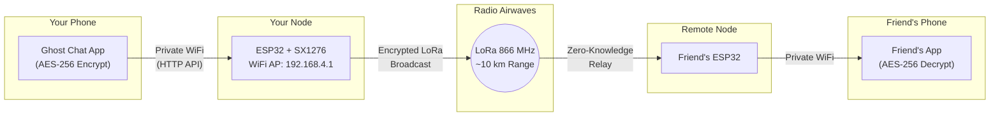

<p align="center">
  
  
  
  
  
  
</p>

---

# 👻 Ghost Chat — Off-Grid Encrypted Tactical Communication Suite

**Ghost Chat** is a fully off-grid, hardware-based encrypted communication system that operates with **zero internet dependency**. It physically bypasses all cell towers, ISPs, and Wi-Fi monitoring by transmitting AES-256 encrypted messages across a LoRa radio mesh network using ESP32 microcontrollers.

> **No server. No cloud. No trace. Just radio.**

---

## 🧠 Key Points

| Point | Detail |
|---|---|
| **What is it?** | A complete chat system that works without internet — uses radio waves instead |
| **How far?** | LoRa radio reaches **up to 10 km** line-of-sight, 2–5 km through buildings |
| **Is it secure?** | AES-256 encryption — same grade used by military and banking |
| **Who can read messages?** | Only people with the correct room password — not even the relay nodes |
| **What hardware?** | Heltec WiFi LoRa 32 V2 (~₹1500/$15) — fits in a pocket |
| **Can it be traced?** | No — creates its own private WiFi network, doesn't touch the internet |
| **What if someone finds the device?** | Panic button (hardware) or duress password (software) wipes everything instantly |
| **Storage?** | 40KB per room on SPIFFS, or unlimited with MicroSD card module |

---

## 🏗️ System Architecture

The system has two parts that work together:

### 1. The Ghost Node (Hardware — ESP32 Firmware)
A **Heltec WiFi LoRa 32 V2** microcontroller that:
- Creates a private WiFi hotspot (`Ghost_Net`)
- Runs a full HTTP web server on `192.168.4.1`
- Stores encrypted messages in SPIFFS/SD filesystem
- Broadcasts & relays messages via LoRa radio at 866 MHz
- Shows live status on a built-in OLED display

### 2. The Ghost App (Software — Native Android)
A native **Kotlin Android application** featuring:
- AES-256 end-to-end encryption (client-side, before transmission)
- Glassmorphism dark-mode UI with smooth animations
- Voice memos with hardware noise suppression
- Burn-on-read messages, bomb images, emoji reactions
- QR code room sharing, radar visualization, and stealth mode



---

## 🚀 Features

### 🔐 Security & Privacy
| Feature | Description |
|---|---|
| **AES-256 Encryption** | All messages encrypted on-device before transmission; ESP32 never sees plaintext |
| **Zero-Knowledge Relay** | Nodes forward messages for other rooms but **cannot decrypt them** |
| **Duress Password** | Entering a special password (`pink`) silently wipes all data and formats the filesystem |
| **Panic Button** | Hold the hardware button for 3 seconds → instant full wipe |
| **Stealth Calculator Mode** | App disguises itself as a calculator — enter your **custom PIN** (configurable in Settings) to unlock |
| **Custom Calculator PIN** | Set your own numeric unlock code in Settings → Security (minimum 4 digits, default `1337`) |
| **Biometric Lock** | Fingerprint/face unlock support via Android BiometricPrompt |
| **Session Tokens** | Each login generates a cryptographic 8-char hex token bound to IP + room hash |
| **XSS Sanitization** | All user input sanitized server-side to prevent injection attacks |
| **Rate Limiting** | Max 10 messages per minute per IP to prevent flooding |
| **No Cloud, No Logs** | Zero telemetry, zero analytics, zero external network calls |

### 💬 Messaging
| Feature | Description |
|---|---|
| **Text Messages** | Standard encrypted text with delivery receipts (✓✓) |
| **Image Sharing** | Upload & share images through the ESP32's filesystem |
| **Voice Memos** | Tap-to-record with `VOICE_COMMUNICATION` audio source for hardware noise suppression |
| **Burn-on-Read** | Messages marked `BURN:` are revealed on tap, then auto-destroyed after 3 seconds |
| **Bomb Images** | View-once images: tap to reveal for 5 seconds, then permanently destroyed |
| **Disappearing Messages** | `EXP:` protocol for time-limited messages that fade out |
| **Emoji Reactions** | Quick-react bar: 👍 ❤️ 😂 😮 😢 🔥 — reactions now display **inline as pills** below the target bubble (no standalone messages) |
| **Reply Threading** | Swipe-to-reply with quoted message preview — replies show an **inline quote bar** inside the bubble with sender name + content preview |
| **Message Forwarding** | Copy message to clipboard for pasting into another room |
| **Message Starring** | Star important messages for quick reference |
| **Message Deletion** | Delete locally or broadcast `CMD:DEL` to all clients — persists across app restarts |
| **Pinned Messages** | Pin important messages visible to the whole room |
| **Typing Indicator** | Real-time animated dots ("user is typing...") with auto-expiry |
| **Search & Highlight** | Search through message history with highlighted results |

### 📡 Network & Hardware
| Feature | Description |
|---|---|
| **LoRa Mesh** | SX1276 radio at 866 MHz, SF7, 125 kHz bandwidth, 17 dBm TX power |
| **Multi-Room** | Infinite rooms via password hashing — each room gets isolated storage |
| **LRU Room Cache** | 5 active rooms cached in RAM; oldest evicted to filesystem on overflow |
| **Auto-Trim** | Messages auto-trimmed when room exceeds 40KB to prevent filesystem overflow |
| **SD Card Support** | Toggle `#define USE_SD_CARD 1` for expanded storage using any MicroSD |
| **OLED Dashboard** | 128×64 OLED displays IP, users online, RAM usage, and LoRa RSSI in real-time |
| **Captive Portal** | DNS spoofing routes all connected devices to the Ghost Chat UI |
| **Low Memory Protection** | Auto-trims room data when free heap drops below 28KB |
| **Online User Tracking** | Heartbeat-based user presence (30s timeout) |

### 🎨 UI/UX (Android App)
| Feature | Description |
|---|---|
| **Chat Wallpaper** | Subtle 45° dark navy-to-charcoal gradient replaces flat backgrounds — Telegram-style depth |
| **ConstraintLayout Bubbles** | Message bubbles rebuilt with `ConstraintLayout` for pixel-perfect timestamp packing and inline metadata |
| **Floating Pill Input** | Input bar is now a detached rounded pill with margins and elevation — feels like Telegram/WhatsApp |
| **Inline Reaction Pills** | Emoji reactions render as small floating pills below the message bubble |
| **Inline Reply Quotes** | Replies show a color-accented quote bar with sender name + preview inside the bubble |
| **Glassmorphism Design** | Dark frosted-glass UI with gradient mesh backgrounds |
| **Message Animations** | Telegram-style slide-up + scale-in on new messages |
| **Send Button Pulse** | Micro-animation bounce on tap |
| **Connection Banner** | Slide-down/up banner showing online/offline status |
| **Online Dot Pulse** | Green dot pulses when connection established |
| **Animated Typing Dots** | Instagram-style cycling dots (0→3, 400ms interval) |
| **Reply Bar Animation** | Smooth slide-up from bottom with fade-in |
| **Fragment Transitions** | Slide-up radar, scale-fade settings |
| **QR Code Room Sharing** | Generate QR with real room credentials for instant invite |
| **Radar Visualization** | Live LoRa node radar with RSSI-based distance mapping |
| **Pull-to-Refresh** | Swipe down to force-fetch latest messages |
| **Haptic Feedback** | System-wide vibration on key interactions |

---

## 📂 Repository Structure

```
yukti/
├── 📱 ghost_chat_android/          ← Native Android App (Kotlin)
│   ├── app/
│   │   ├── build.gradle.kts        ← Dependencies & SDK config
│   │   └── src/main/
│   │       ├── AndroidManifest.xml  ← Permissions & activities
│   │       ├── java/com/ghost/app/
│   │       │   ├── MainActivity.kt           ← App entry, login flow
│   │       │   ├── ChatFragment.kt           ← Main chat UI (490+ lines)
│   │       │   ├── ChatViewModel.kt          ← State management, polling
│   │       │   ├── ChatMessage.kt            ← Message data model
│   │       │   ├── MessageAdapter.kt         ← RecyclerView adapter
│   │       │   ├── MessageActionSheet.kt     ← Long-press context menu
│   │       │   ├── ChatItemAnimator.kt       ← Message bubble animations
│   │       │   ├── GhostApi.kt               ← HTTP API client
│   │       │   ├── GhostCrypto.kt            ← AES-256 encryption
│   │       │   ├── GhostRepository.kt        ← Message parsing & storage
│   │       │   ├── SecurePrefs.kt            ← Encrypted preferences
│   │       │   ├── RadarFragment.kt          ← LoRa radar visualization
│   │       │   ├── LoginFragment.kt          ← Room login UI
│   │       │   ├── LoginViewModel.kt         ← Login state
│   │       │   ├── SettingsFragment.kt       ← Settings & QR generator
│   │       │   ├── StarredMessagesFragment.kt← Starred messages viewer
│   │       │   ├── StealthActivity.kt        ← Calculator disguise
│   │       │   ├── BiometricHelper.kt        ← Fingerprint/face auth
│   │       │   ├── SwipeReplyCallback.kt     ← Swipe-to-reply gesture
│   │       │   ├── NetworkBinder.kt          ← WiFi network binding
│   │       │   ├── PanicWipeHelper.kt        ← Emergency data wipe
│   │       │   ├── ImageLoader.kt            ← Async image loading
│   │       │   └── GlassHelper.kt            ← Glassmorphism effects
│   │       └── res/
│   │           ├── anim/                      ← 6 animation XMLs
│   │           ├── drawable/                  ← 14 drawable XMLs
│   │           ├── layout/                    ← 11 layout XMLs
│   │           └── values/                    ← Themes, colors, strings
│   ├── build.gradle.kts
│   ├── settings.gradle.kts
│   └── gradle.properties
│
├── 🔌 ghost_chat_v3_sx1276/        ← ESP32 Firmware (C++)
│   └── ghost_chat_v3_sx1276.ino    ← Complete firmware (747 lines)
│
├── 📦 Ghost_Chat.apk               ← Pre-built debug APK (install directly)
├── 📄 README.md                     ← This file
└── 📋 Ghost_Chat_Final_Report.docx  ← Project documentation
```

---

## ⚙️ ESP32 Firmware Configuration

### Default Configuration (change before flashing)
```cpp
#define USE_SD_CARD    0               // 0 = SPIFFS, 1 = MicroSD card
WIFI_SSID            = "Ghost_Net"     // Hotspot name
WIFI_PASS            = "ghost1234"     // Hotspot password
DURESS_PASS          = "pink"          // Wipes everything silently
ADMIN_PASS           = "ghostadmin99"  // Admin panel access
NODE_ID              = "NODE-A"        // LoRa node identity
LORA_FREQ            = 866E6           // 866 MHz (India band)
LORA_POWER           = 17              // Transmit power in dBm
MAX_ROOM_BYTES       = 40000           // 40KB per room storage
MAX_ACTIVE_ROOMS     = 5               // Rooms cached in RAM
```

### Hardware Pin Map (Heltec WiFi LoRa 32 V2)
```
LoRa SX1276:  SCK=5, MISO=19, MOSI=27, SS=18, RST=14, DIO0=26
OLED SSD1306: SDA=4, SCL=15, RST=16
Panic Button: GPIO 0 (built-in BOOT button)
SD Card (opt): CS=13 (VSPI)
```

### API Endpoints
| Endpoint | Method | Description |
|---|---|---|
| `/login` | GET | Authenticate with room hash + password → returns session token |
| `/send` | GET | Send encrypted message (requires `tok` param) |
| `/read` | GET | Fetch all messages for current room + typing status + online count |
| `/typing` | GET | Broadcast typing indicator (auto-expires after 3s) |
| `/online` | GET | Get count of online users (30s heartbeat window) |
| `/upload` | POST | Upload image/file to filesystem |
| `/download` | GET | Download file by name |
| `/delete_file` | GET | Delete uploaded file |
| `/pin` | GET | Pin a message for the room |
| `/getpin` | GET | Get current pinned message |
| `/clear` | GET | Clear all messages in current room |
| `/status` | GET | System status (RAM, uptime, WiFi clients, LoRa, filesystem) |
| `/lorastatus` | GET | LoRa radio status (RSSI, last packet time) |
| `/ram` | GET | Free heap memory in KB |
| `/admin` | GET | Admin panel JSON (requires admin password) |
| `/admin_wipe` | POST | Full system wipe (requires admin password) |

---

## 🛠️ How to Deploy

### Prerequisites
- **Arduino IDE** 2.x with ESP32 board manager installed
- **Android Studio** Ladybug+ (for building from source) or just install the APK
- **Heltec WiFi LoRa 32 V2** board (or compatible ESP32 + SX1276)
- **Libraries:** `LoRa`, `U8g2`, `WiFi`, `WebServer`, `SPIFFS`, `SD` (all available in Library Manager)

### Step 1: Flash the ESP32 Firmware
1. Open `ghost_chat_v3_sx1276/ghost_chat_v3_sx1276.ino` in Arduino IDE
2. Select Board: **Heltec WiFi LoRa 32 (V2)**
3. Edit configuration constants at the top (WiFi name, passwords, frequency)
4. Set partition scheme to **"Minimal SPIFFS (1.9MB APP with OTA/190KB SPIFFS)"** for max app space, or **"Default 4MB with SPIFFS"** for more storage
5. Click **Upload** → Wait for flash to complete
6. The OLED will display `Ghost Chat V4` + IP address when ready

### Step 2: Install the Android App

**Option A: Install pre-built APK (fastest)**
1. Transfer `Ghost_Chat.apk` to your Android phone
2. Enable "Install from unknown sources" in Settings
3. Tap the APK to install

**Option B: Build from source**
1. Open `ghost_chat_android/` folder in Android Studio
2. Sync Gradle dependencies
3. Build → Run on device or `./gradlew assembleDebug`

### Step 3: Connect & Chat
1. Power on the ESP32 → OLED shows `Ghost_Net` and IP
2. On your phone, connect to WiFi network `Ghost_Net` (password: `ghost1234`)
3. Open the Ghost Chat app
4. Enter a username, set a room password → this creates an encrypted room
5. Share the room password with friends → they join the same encrypted channel
6. **Start chatting!** All messages are AES-256 encrypted end-to-end

---

## 📡 LoRa Mesh — How It Works

```
┌─────────────────────────────────────────────────────────────┐
│                    LoRa Packet Format                        │
│  GC|<NODE_ID>|<ROOM_HASH>|<ENCRYPTED_PAYLOAD>              │
│                                                              │
│  Example:                                                    │
│  GC|NODE-A|a3f8c2|U2FsdGVkX1+vup...                        │
│                                                              │
│  • NODE_ID prevents echo loops (ignores own packets)         │
│  • ROOM_HASH routes to correct room (zero-knowledge)         │
│  • PAYLOAD is AES-256 ciphertext (node can't read it)        │
└─────────────────────────────────────────────────────────────┘
```

**Mesh Relay Logic:**
1. Node A sends a message → broadcasts via LoRa
2. Node B receives the packet → checks if `NODE_ID` is different from its own
3. Node B appends the encrypted payload to the matching room file
4. Any phone connected to Node B can now read (and decrypt) the message
5. The relay node **never knows the content** — it only knows the room hash

---

## 🔒 Message Protocol Types

| Protocol Prefix | Format | Description |
|---|---|---|
| *(none)* | `sender\|time\|text` | Standard text message |
| `IMG:` | `sender\|time\|IMG:filename.jpg` | Image attachment |
| `VOX:` | `sender\|time\|VOX:audio.m4a` | Voice memo |
| `BURN:` | `sender\|time\|BURN:secret text` | Burn-on-read (auto-destroys) |
| `CMD:DEL` | `sender\|time\|CMD:DEL:msgId` | Delete message command |
| `REACT:` | `sender\|time\|REACT:<sha256_hash>§emoji` | Emoji reaction — targets message by **deterministic SHA-256 hash** |
| `REPLY:` | `sender\|time\|REPLY:<hash>\|<sender>\|<preview>§<content>` | Quoted reply — links to target via hash |
| `EXP:` | `sender\|time\|EXP:epoch\|text` | Disappearing message |
| `###TYPE:` | (appended to /read response) | Typing indicator |
| `###ONLINE:` | (appended to /read response) | Online user count |

### 🆔 Deterministic Message IDs (V8.0)
Every message gets a **unique 8-character hex ID** generated by:
```
SHA-256( sender + "|" + time + "|" + content ) → first 8 hex chars
```
This ID is **deterministic** — the same message content on any device produces the **same hash**. This solves the distributed systems problem: reactions and replies work perfectly across all nodes in the mesh, even if devices join at different times or receive messages in different order.

---

## 📊 Performance & Limits

| Parameter | Value |
|---|---|
| **Max message length** | 1,500 characters |
| **Max room storage** | 40 KB per room (SPIFFS) / Unlimited (SD card) |
| **Active rooms in RAM** | 5 (LRU eviction to filesystem) |
| **Max sessions** | 8 concurrent |
| **Max tracked users** | 10 |
| **Rate limit** | 10 messages/minute/IP |
| **User online timeout** | 30 seconds heartbeat |
| **Typing indicator timeout** | 3 seconds auto-clear |
| **LoRa range** | ~10 km LOS / ~2-5 km urban |
| **LoRa packet max** | 200 bytes per broadcast |
| **Burn message reveal** | 3 seconds (text) / 5 seconds (images) |
| **Min voice memo length** | 1 second |
| **OLED refresh rate** | Every 3 seconds |

---

## 🔧 Expanding Storage (No SD Card Module Needed)

The firmware already has built-in SD card support — **you don't need to buy any extra module** if you just want more software-side storage. Here's how:

### Option 1: Increase SPIFFS Limits (No hardware changes)
Edit the firmware constants:
```cpp
#define MAX_ROOM_BYTES  80000     // 80KB per room
#define MAX_ACTIVE_ROOMS 8        // More rooms in RAM
```
> ⚠️ Keep `MIN_FREE_HEAP` at 28000 to prevent crashes

### Option 2: Use SD Card (Maximum storage)
1. Connect any MicroSD module to the VSPI pins (CS = GPIO 13)
2. Change `#define USE_SD_CARD 1` in the firmware
3. Re-flash → now uses SD instead of SPIFFS (gigabytes of storage)

### Option 3: Auto-Cleanup (Software approach)
The firmware already auto-trims old messages when a room exceeds `MAX_ROOM_BYTES`. The oldest messages are removed first, keeping the most recent conversation intact.

---

## 🛡️ Emergency Protocols

### 🔴 Hardware Panic Wipe
Hold the **BOOT button** (GPIO 0) for 3 seconds:
- OLED shows countdown: `HOLD TO WIPE → 3... 2... 1...`
- All rooms, sessions, users, and files are permanently erased
- SPIFFS is formatted (all data destroyed)
- OLED confirms: `WIPED CLEAN`

### 🟡 Software Duress Wipe
Enter the duress password (`pink` by default) as the room password:
- Server responds `WIPED` to the client
- All data silently destroyed
- No visual indication to bystanders — looks like a normal failed login

### 🔵 App Stealth Mode
In Settings, toggle "Calculator Disguise":
- App icon changes to a calculator
- App name changes to "Calculator"
- Opening the app shows a **fully working calculator** (add, subtract, multiply, divide)
- Enter your **custom secret PIN** + `=` to unlock Ghost Chat
- Default PIN is `1337` — **change it in Settings → Security → Calculator Unlock PIN**
- Minimum 4 digits required; stored in EncryptedSharedPreferences
- App becomes invisible in recent apps

---

## 📌 Version History

| Version | Changes |
|---|---|
| **V1** | Basic ESP32 + React Native prototype |
| **V2** | Added LoRa mesh relay, SPIFFS storage |
| **V3** | SX1276 chip support, captive portal |
| **V4** | Dynamic rooms, SD card support, admin panel |
| **V5** | Native Android (Kotlin) rewrite, glassmorphism UI |
| **V6** | AES-256 encryption, burn messages, QR sharing, biometrics |
| **V7** | Stable message IDs, fixed deletion, radar, mic UX, animations |
| **V7.1** | Fixed reaction display, bomb image/text, long-press reliability, 40KB rooms |
| **V8.0** | **Deterministic SHA-256 message IDs** — perfect sync across distributed mesh. **ConstraintLayout bubbles** with packed timestamps. **Inline reaction pills** & **reply quote bars** inside bubbles. **Floating pill input** with chat wallpaper gradient. **Custom calculator PIN** configurable in Settings. Protocol additions: `REPLY:` wire format. 6 bug fixes including duplicate `hideReplyBar`, `continue` in `forEachIndexed`, and missing recording bar views. |

---

## 🤝 Contributing

This is an educational/research project. Contributions welcome:
1. Fork the repository
2. Create a feature branch
3. Submit a pull request with description

---

## ⚠️ Disclaimer

> This project is intended for **educational, research, emergency, and off-grid communication purposes only**. The developers assume no responsibility for misuse. Operating on unlicensed radio frequencies may be subject to local regulations — check your country's spectrum allocation before deploying. In India, the 866 MHz ISM band is available for low-power devices.

---

<p align="center">
  <b>Built with 💀 by Team Ghost</b><br>
  <i>No servers. No internet. No trace.</i>
</p>
