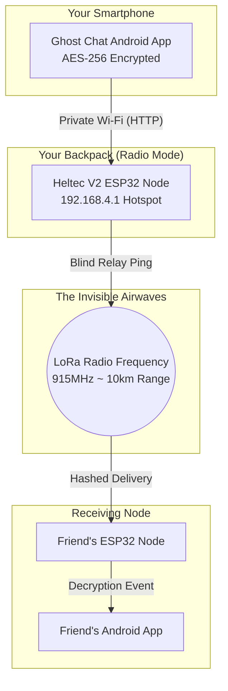

  
  
  

# 👻 Ghost Chat: The Decentralized "Dark Web" Hardware Protocol

**Ghost Chat** is a completely off-grid, hardware-based communication network designed for maximum anonymity and zero external trace. It physically bypasses all cell towers, internet service providers, and localized Wi-Fi monitoring by bouncing AES-256 encrypted messages across a physical mesh of ESP32 radio nodes.

It consists of two parts running in tandem:
1. **The Ghost Node (Hardware):** A Heltec V2 ESP32 microchip that uses LoRa radio frequencies to bounce data miles across a city.
2. **The Ghost App (Software):** A beautiful, standalone Android application that natively encrypts your messages and streams them to the Node.

---

## 🚀 How it Works (For Normal Users)

Imagine you want to send a secure message to your friend across a college campus, but you know the school is monitoring the Wi-Fi space, and the cellular network is tracking your location. 

Normally, messaging apps (like WhatsApp or Telegram) send your text to a giant corporate server, which then reads it and forwards it to your friend. **Ghost Chat destroys the server.** 

Instead, the Ghost App on your phone connects directly to a tiny `$15` radio chip in your backpack via its own private Wi-Fi. When you hit send, the app encrypts your message with military-grade math and forces the radio chip to blast it into the air over the `915MHz` Long-Range (LoRa) frequency. Because it uses LoRa, your message can travel **up to 10 kilometers** through concrete buildings, completely invisible to standard internet infrastructure!

### 🗺️ The Mesh Topology Diagram

---

## 🌟 Premium Features

*   **Zero-Knowledge Relaying:** Your ESP32 node will automatically forward and bounce messages for other people out on the streets, *but it cannot read them*. The encryption key stays permanently locked on your phone.
*   **Burn-On-View & Duress Wipes:** Features native "Bomb Images" that cryptographically disintegrate after being viewed. If compromised, typing the wipe command physically overwrites the ESP32's flash memory.
*   **Android App Native Glassmorphism:** Features a premium, iOS-style frosted glass UI built in React Native, easily rivaling the design of Telegram and iMessage.

## 🛠️ Tech Stack & Directory Structure

*   **/ghost_chat_esp_node:** The core C++ ESP32 firmware. Open and flash this using the Arduino IDE. Contains the async webserver and SPIFFS SD storage mechanisms.
*   **/ghost_chat_app:** The React Native Mobile Application. Uses `expo-blur`, `@react-navigation/native-stack`, and custom base-64 cryptography.

## ⚙️ How to Deploy

### 1. Flash the Node Core
Open `/ghost_chat_esp_node/ghost_chat_esp_node.ino` in the standard **Arduino IDE**. You must install the `ESP32` board manager and the `LoRa` library. Flash the code to the board.

### 2. Connect Your Phone
Once the Heltec board turns on, its OLED screen will light up.
1. Open your Android Wi-Fi Settings.
2. Connect to the network named `Ghost_Net` (Password: `ghost123`).

### 3. Start Ghost Chatting
If you have compiled the `.apk` from the `/ghost_chat_app/` folder using Expo, simply open the Ghost Chat App on your phone. You will be greeted by the deep dark-web initialization terminal. Type in an Alias, set a localized room key, and establish the uplink.

---
> ⚠️ **Disclaimer:** This project is intended for educational, forensic, and survival communication purposes. The developers take no responsibility for data sent over unmanaged radio spectrums.
